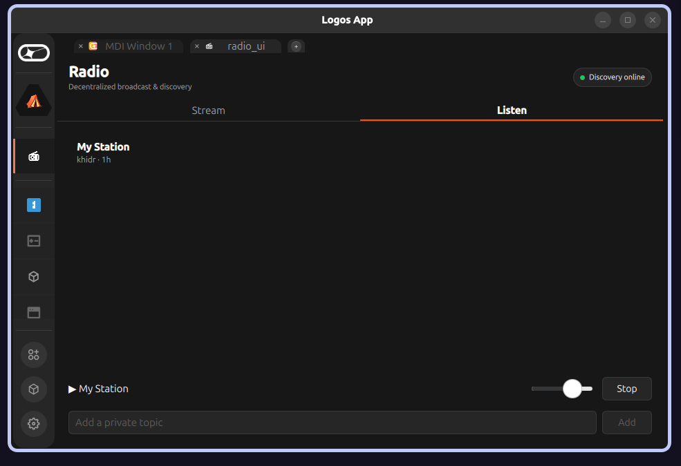

# booth-basecamp

**Booth** — the sovereign, decentralized **broadcaster** for [Logos Basecamp](https://github.com/logos-co/logos-app).
Point OBS at Booth, hit **Start**, and it announces your station **over LogosMessaging by topic** — no
central index, no account, no directory server. Each station has a **verifiable, key-based identity**:
broadcasters sign their announces, so a station **is its public key**, not a name anyone can grab.
**Listening lives entirely in the sibling [Receiver](https://github.com/xAlisher/receiver-basecamp)
module** — Booth is broadcast-only.

> **Naming:** the product/repo is **Booth** (`booth-basecamp`) and the UI panel reads **Booth —
> "Decentralized broadcast."** The internal **module IDs stay `radio_module` (core) + `radio_ui`
> (ui_qml)** and the universal API is still **`modules().radio_module`** — unchanged for
> compatibility. Booth is the product name; `radio_*` are the module identifiers.

> **📦 Install:** grab the signed **[release](https://github.com/xAlisher/booth-basecamp/releases)**
> (`radio_module` + `radio_ui`, ✓ Signed by xAlisher) — see [Install](#install-into-logos-basecamp).
> Universal API (`modules().radio_module`) + design-system UI. Runs on Basecamp **v0.2+**: Start →
> MediaMTX → credentials → signed announce published.

> Status (2026-07-05): **broadcast-only, universal API + design-system, on the current v0.2 platform.**
> The old **268-only** caveat is resolved (the v0.2 migration fixed the `delivery_module` consumer
> hang, logos-basecamp#150). The Listen tab was removed — listening is the Receiver's job.

---

## Demo

> ⚠️ Screenshots below predate the Booth rebrand + identity work and may be stale — treat them as
> illustrative, not current.

Two machines, no server between them — Booth streams from OBS while a *separate* **Receiver**
discovers the station over LogosMessaging (Waku), verifies its signature, and plays it:

| Booth — start a station | Receiver — discovered, verified & playing |
|:--:|:--:|
|  |  |

---

## What it does

- **Broadcast** — point OBS at a generated ingest URL; Booth runs the origin and announces the station.
- **Sign** — every announce is signed with the station's key (see [Station identity](#station-identity-🔑)),
  so listeners can verify who's broadcasting — rename-proof, impersonation-resistant.
- **Choose reach** — announce on the **public** directory topic (everyone's Receiver sees it) or a
  **private** per-stream topic you share out-of-band (invite-only).
- **Choose exposure** — **Hide IP with Tor** (`.onion`, NAT-friendly) or **Show IP (LAN)** for
  local low-latency (see [Privacy](#privacy-🧅)).
- **Sovereign** — no platform, no directory server, no account.

## Quick start (broadcasting)

1. Open **Booth** → name your station → pick a **Station identity** (Anonymous / Autogenerated /
   Keycard) → choose **Public** or **Private** reach → set **Privacy** (Tor / LAN) → **Start**.
2. Booth shows an **OBS setup card** (WHIP / RTMP / SRT). Copy the values into OBS and
   **Start Streaming** in OBS. → **Full guide: [`docs/CONNECTING-OBS.md`](docs/CONNECTING-OBS.md)**
3. When the status light turns **🔴 Live**, your station is signed and announced over LogosMessaging.
   If you picked a signed identity, **share your [station fingerprint](#station-identity-🔑)** so
   listeners can verify it's really you.

Discovery and playback happen in the [Receiver](https://github.com/xAlisher/receiver-basecamp) — Booth
does not listen.

### Public vs. private reach

Announces travel over **LogosMessaging topics**, and as the broadcaster you choose which:

- **Public** — Booth announces on the well-known **directory topic**
  (`/radio-basecamp/1/directory/json`) that every Receiver auto-subscribes to, so your station shows
  up for everyone.
- **Private** — Booth announces on an **unguessable per-stream topic**
  (`/radio-basecamp/1/<random>/json`) that's **not** on the public directory. Share that topic string
  **out-of-band** (e.g. a DM) and only listeners who paste it into their Receiver will see the station
  — an **unlisted / invite-only broadcast**.

Stations drop off a Receiver's list automatically when their heartbeats stop (45 s TTL = 3 missed
heartbeats).

## Station identity 🔑

A station **is its public key, not its name** — so nobody can impersonate you by copying your station
name. Booth signs every announce with **secp256k1 ECDSA**, and the Receiver verifies each one. Pick a
**Station identity** tier from the dropdown:

| Tier | Keys | Portability |
|------|------|-------------|
| **Anonymous** | none — announces are **unsigned** | — |
| **Autogenerated** | a **device-local** key, persisted on this machine | same identity only on *this* device |
| **Keycard** | a **hardware-backed** key derived from a [Logos Keycard](https://github.com/logos-co) | **same identity/fingerprint on ANY device** with the card |

For **Keycard**, hit **Connect Keycard** — the Keycard module holds the key and does the signing; the
private key never leaves the card.

Every **signed** station gets a **3-word, PGP-style fingerprint** derived from its public key — e.g.
**`newborn vocalist uncut`** — shown in the UI as *"Station fingerprint — share so listeners verify
you."* It's the **out-of-band anchor**: tell people your fingerprint, and their Receiver shows the
**same** three words when they tune in. Because the fingerprint is derived from the key (not the name),
renaming your station doesn't change it, and no impostor can reproduce it.

## Privacy 🧅

A **Privacy** toggle picks how your address is exposed:

- **Hide IP with Tor** — Booth runs a **Tor hidden service** in front of its origin and announces a
  `…​.onion` URL. **No IP appears in the announce or on the wire**, and it reaches listeners through
  **NAT with no port-forwarding**. First connect is slower (Tor circuit setup); the Receiver's jitter
  buffer rides out the latency. The `.onion` and stream key **persist across restarts** (rotate on
  demand with ⟳).
- **Show IP (LAN)** — direct pull from the origin for local/low-latency use. The announce carries the
  host address and host↔listener IPs are mutually exposed (LAN-scoped).

Full threat model + ranked options:
[`docs/BRIEF.md` §Privacy](docs/BRIEF.md#️-privacy--threat-model--v1-hides-discovery-not-the-streamers-ip).

## How it works

```
Booth                      LogosMessaging topic          Receiver (sibling module)
 | OBS → MediaMTX (WHIP/RTMP/SRT)   |                         |
 | MediaMTX serves HLS .m3u8        |                         |
 | sign+announce(name,url,pubkey) ->|------------------------>| discovers + verifies signature
 |                                  |   (15s re-announce)     | → shows station fingerprint
 | <====== HTTP: Receiver pulls HLS from MediaMTX (direct or via Tor) ======>|
```

Two modules (tutorial-v3 canonical: core + QML UI):

| Module | Type | Role |
|--------|------|------|
| `radio_module` | `core` | MediaMTX origin control, ingest minting, status polling, secp256k1 signing (device key / Keycard), `delivery_module` announce, heartbeat/TTL |
| `radio_ui` | `ui_qml` (QML-only) | The Booth broadcast panel — identity, privacy, reach, OBS card — calling `radio_module` via the `logos` bridge |

**Key platform facts** (see [`docs/BRIEF.md`](docs/BRIEF.md) §Feasibility): the QML sandbox blocks
network/subprocess, so all I/O (MediaMTX, Tor, signing, delivery) lives in the core module; "Waku" is
now `delivery_module` (LogosMessaging), which has no history query, so discovery is heartbeat-only.

## Dependencies

| Module | Installed name | Repo | Role |
|--------|----------------|------|------|
| **Booth** (this) | `radio_module` | this repo | core logic + signing |
| **Booth UI** (this) | `radio_ui` | this repo | QML UI |
| **delivery** | `delivery_module` | [logos-delivery-module](https://github.com/logos-co/logos-delivery-module) (pinned v0.1.1) | LogosMessaging announce/subscribe |
| **keycard** | `keycard_module` | [logos](https://github.com/logos-co) | hardware-backed signing (Keycard identity tier) |

External runtime binaries for broadcasting (not yet bundled in the LGX — see Install):
- **OBS Studio** (capture) + **MediaMTX** (ingest / HLS origin; `scripts/install.sh` drops a static build into the module dir).
- **tor** (for **Hide IP with Tor** mode — system `apt install tor`, or nix).
- **ffmpeg** (media plumbing).

Each binary is resolved as: `RADIO_*_BIN` env override → `<module-dir>[/bin]/<tool>` → `PATH`.

## Build

```bash
git add -A                       # Nix only sees tracked files
cd radio_module && nix build     # → result/lib/radio_module_plugin.so
cd ../radio_ui   && nix run .     # launches the UI in logos-standalone-app
```

### Install into Logos Basecamp

**Signed release** (✓ Signed by xAlisher — no `--allow-unsigned`). On Basecamp **v0.2+** (universal
API). Runtime deps on PATH: `ffmpeg`, `tor` (for `.onion`), `mediamtx` (ingest / HLS origin). Install
both artifacts — `radio_ui` depends on `radio_module` (module IDs are unchanged despite the Booth rebrand):

```bash
PROF=~/.local/share/Logos/LogosBasecamp
base=https://github.com/xAlisher/booth-basecamp/releases/latest/download
for f in radio_module radio_ui; do
  curl -fL -o "$f-linux-amd64.lgx" "$base/$f-linux-amd64.lgx"
  lgpm --modules-dir "$PROF/modules" --ui-plugins-dir "$PROF/plugins" install --file "$f-linux-amd64.lgx"
done
```
Then launch Basecamp and open **Booth**.

From source:

```bash
./scripts/install.sh    # builds both .lgx and lgpm-installs to LogosBasecamp
./scripts/relaunch.sh   # kills logos_host + restarts the AppImage
```

### Installing `delivery_module` (required — it does **NOT** ship with the platform)

`radio_module` depends on `delivery_module`, and **no Basecamp build or catalog bundles it** — you
install it yourself. Pin it to **`v0.1.1`** (rev `0c346c0c`, metadata version `1.1.0`). Do **not** use
`main` or another commit: `radio_module` is compiled against v0.1.1's IPC API, and a newer delivery
drifts the `Q_INVOKABLE` signatures → `"Invalid response"` / load crashes. Pick one path:

**A — prebuilt LGX (no Nix needed).** Grab
[`dist/delivery_module-v0.1.1-linux-amd64.lgx`](dist/delivery_module-v0.1.1-linux-amd64.lgx) (also on
[Releases](https://github.com/xAlisher/booth-basecamp/releases)) and install it:

```bash
MDIR="$HOME/.local/share/Logos/LogosBasecamp/modules"          # Linux profile path
lgpm --modules-dir "$MDIR" --allow-unsigned install --file delivery_module-v0.1.1-linux-amd64.lgx
```

**B — build it from source (Nix).** Same artifact, built locally:

```bash
nix build "github:logos-co/logos-delivery-module/v0.1.1#lgx-portable"
lgpm --modules-dir "$MDIR" --allow-unsigned install --file result/*.lgx
```

**C — no `lgpm`, no Nix (manual dev-install).** Extract the LGX and drop the linux variant in by hand:

```bash
mkdir -p "$MDIR/delivery_module" && tar xzf delivery_module-v0.1.1-linux-amd64.lgx -C /tmp/dm
cp -r /tmp/dm/variants/linux-amd64/. "$MDIR/delivery_module/" && cp /tmp/dm/manifest.json "$MDIR/delivery_module/"
printf linux-amd64 > "$MDIR/delivery_module/variant"
```

`radio_module` + `radio_ui` install the same way (from this repo's Releases — see above).

> **⚠️ Runtime binaries:** the LGX bundles only the plugins (runtime-binary bundling is blocked on
> [logos-module-builder#114](https://github.com/logos-co/logos-module-builder/issues/114)). Install
> `mediamtx` + `ffmpeg` + `tor` via apt/nix, or point the `RADIO_*_BIN` env overrides at them.

## Test (headless)

```bash
# Core — in-process harness (instantiates the plugin; proves start/spawn/mint/status/sign/announce/TTL)
radio_module/tests/run-direct-test.sh
# Core — logoscore load/dispatch smoke
radio_module/tests/run-headless-tests.sh
# UI — QML loads + elements instantiate
cd radio_ui && nix build .#integration-test -L
```

See [`docs/plans/radio-implementation.md`](docs/plans/radio-implementation.md) (evidence matrix)
for exactly what each test proves and what still needs the running AppImage.

## Configuration (env overrides)

| Var | Default | Purpose |
|-----|---------|---------|
| `RADIO_RTMP_PORT` / `RADIO_WHIP_PORT` / `RADIO_SRT_PORT` / `RADIO_HLS_PORT` / `RADIO_API_PORT` | 1935 / 8889 / 8890 / 8888 / 9997 | Origin ports |
| `RADIO_DIRECTORY_TOPIC` | `/radio-basecamp/1/directory/json` | Public discovery topic |
| `RADIO_HEARTBEAT_MS` | 15000 | Re-announce interval |
| `RADIO_TTL_MS` | 45000 | A Receiver drops a station after this without a heartbeat |
| `RADIO_MEDIAMTX_BIN` / `RADIO_FFMPEG_BIN` | `mediamtx` / `ffmpeg` | Binary paths |

## License

Free and open source, dual-licensed under either of [MIT](LICENSE-MIT) or
[Apache-2.0](LICENSE-APACHE) at your option — matching the Logos ecosystem convention.
